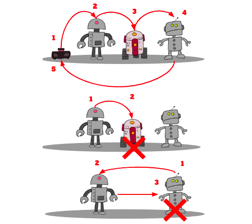

## Comptar Ovelles per Color

### Descripció:
Programa de C# en el cual a través de un array de números i una llista d'elements hem d'anar comptant (al arribar al final tornar al principi)
i eliminar l'element que correspongui per el seu índex.

### Objectiu:
Donada una llista d'elements i un array de números hem de mostrar l'element guanyador, el que s'ha salvat de ser eliminat.
> Aquest exercici i els dibuixos els ha creat en Xavier Sala --- [@utrescu](https://github.com/utrescu) 
